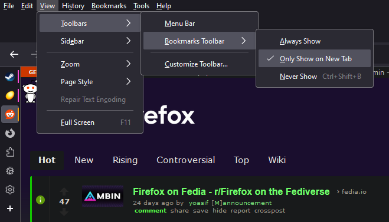
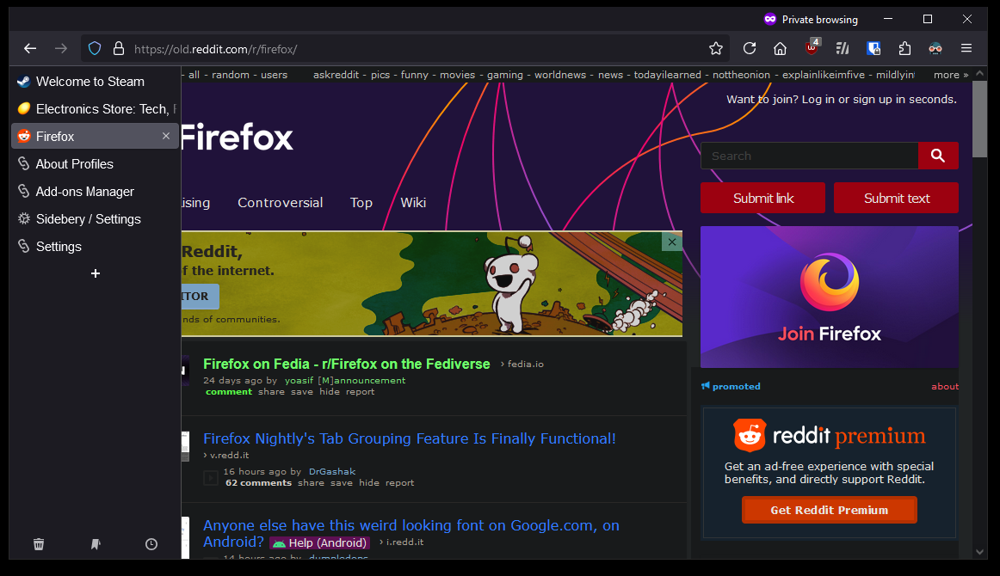

# Firefox
userChrome.css and other settings for setting up vertical tabs in Firefox

## How to use
1. Make a backup of your current .\chrome\userChrome.css or create it if it does not exist. This is located in your default profile's root directory (Path can be found by going to about:profiles)

   a. If you had to create the chrome\userChrome.css structure then you will also need to enable firefox to use it. Firefox now disables userChrome.css modifications by default now.
      - Navagate to `about:config`
      - Set `toolkit.legacyUserProfileCustomizations.stylesheets` to `true`
3. Copy the userChrome.css file from this project into your profile's .\chrome\ directory or copy the contents into your userChrome.css file.
4. Set bookmarks toolbar to only show on new tabs (makes ff look cleaner but is optional)

5. Install the extension Sidebery to enable vertical tabs (I also recommend multi-account containers for added security cross accounts/sites)
  a. Sidebery Settings:
    - Use Native context menu : On
    - Navigation Bar > Layout: Hidden
    - Containers > Sort containers by name: On
    - Tabs > Position of new tab > Place new tab opened from pinned tab: Panel End
    - Tabs > Tinned Tabs > Prevent pinned tabs from unloading: On
    - Tabs > Tab Tree > Tabs tree structure: Off
    - Appearance > Font Size: XXS
    - Tab Actions > Activate previously active tab when clicking on the active tab (Tab flip): On
7. navigate to `about:config` and set `sidebar.revamp` to `false`
8. Restart Firefox

example of what this looks like expanded and collapsed when you mouse over/off of the side bar.

